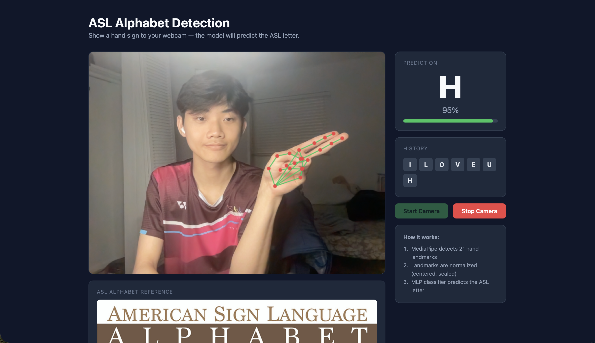
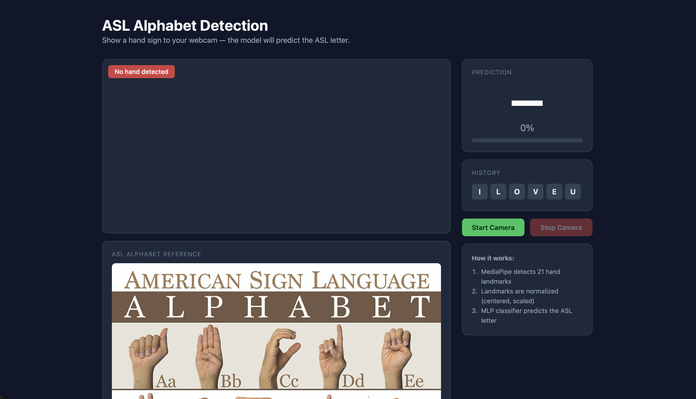
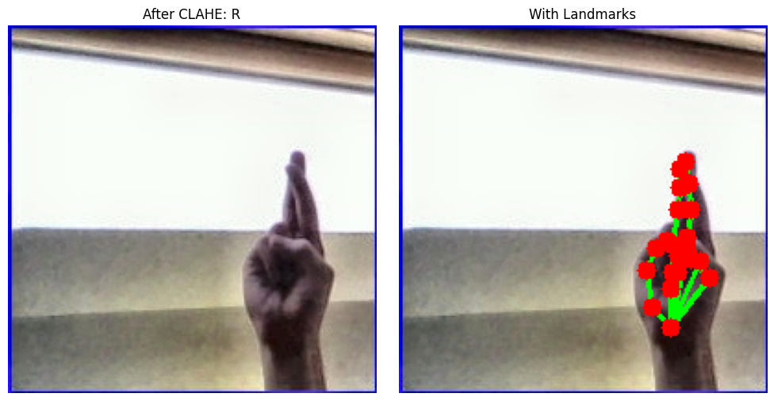
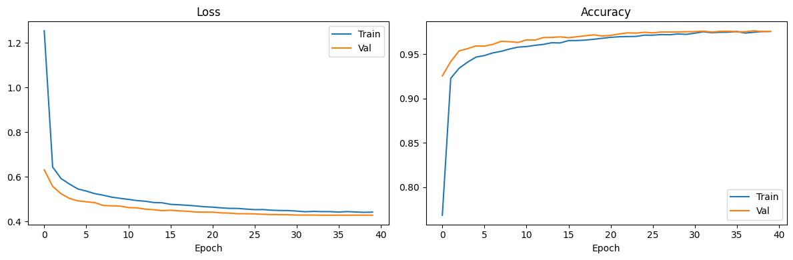
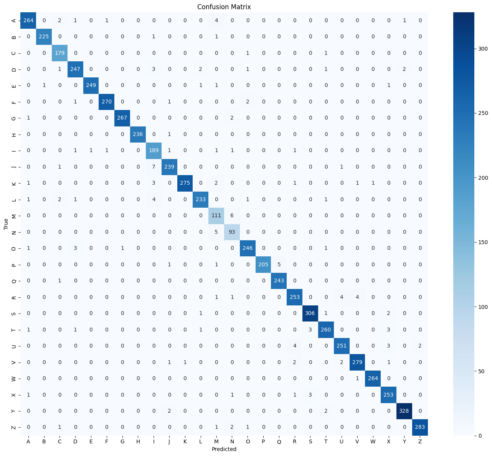

# ASL Alphabet Detection

Real-time American Sign Language (ASL) alphabet recognition using **MediaPipe hand landmarks** and a lightweight **MLP classifier**, served as a web app with **FastAPI**.


<p align="center">
  
</p>

<p align="center"><em>Real-time ASL letter detection — predicting "H" at 95% confidence with hand landmarks overlay</em></p>

---

## Table of Contents

- [Overview](#overview)
- [Demo](#demo)
- [How It Works](#how-it-works)
- [Project Structure](#project-structure)
- [Setup & Installation](#setup--installation)
- [Dataset](#dataset)
- [Training the Model](#training-the-model)
- [Training Results](#training-results)
- [Running the Web App](#running-the-web-app)
- [Running the Desktop App](#running-the-desktop-app)
- [API Endpoints](#api-endpoints)
- [Model Architecture](#model-architecture)
- [Technologies Used](#technologies-used)

---

## Overview

This project detects ASL alphabet letters (A–Z) in real time from a webcam feed. Instead of using a heavy CNN on raw pixel images, it leverages **MediaPipe's hand landmarker** to extract 21 3D keypoints from each hand, then classifies those 63 features with a small MLP — achieving **~97% validation accuracy** with fast, lightweight inference.

The system is available as:
- A **FastAPI web app** (browser-based webcam, works on any device)
- A **desktop script** using OpenCV (local webcam via `realtime_asl.py`)
- A **Jupyter notebook** for training, evaluation, and experimentation

---

## Demo

### Web App Interface

<p align="center">
  
</p>

The web app features a clean dark-themed UI with:
- Live webcam feed with hand landmark overlay
- Real-time prediction display with confidence bar
- Letter history tracking
- ASL alphabet reference chart for guidance

### Live Detection

<p align="center">
  
</p>

The model detects hand signs in real time, drawing MediaPipe landmarks on your hand and displaying the predicted ASL letter with a confidence score.

---

## How It Works

```
Webcam Frame
     │
     ▼
┌─────────────────┐
│  CLAHE Enhance   │  Adaptive histogram equalization
│                  │  for dark/low-contrast images
└────────┬────────┘
         │
         ▼
┌─────────────────┐
│  MediaPipe Hand  │  Detects 21 hand keypoints (x, y, z)
│   Landmarker     │  per frame — invariant to background,
└────────┬────────┘  lighting, and skin tone
         │
         ▼
┌─────────────────┐
│  Normalization   │  Center on wrist (landmark 0),
│                  │  scale to unit max distance
└────────┬────────┘
         │
         ▼
┌─────────────────┐
│  MLP Classifier  │  63 → 512 → 256 → 128 → 26
│  (PyTorch)       │  ~200K parameters, <1ms inference
└────────┬────────┘
         │
         ▼
   Predicted Letter (A–Z) + Confidence
```

### Landmark Extraction with CLAHE

<p align="center">
  
</p>

<p align="center"><em>Left: Image after CLAHE enhancement — Right: MediaPipe 21-point hand landmarks detected</em></p>

**Why landmarks instead of pixels?**
- **63 features** vs 200×200×3 = 120,000 pixels — orders of magnitude smaller input
- Invariant to background, lighting, skin tone, and hand scale
- MLP inference takes <1ms (vs ~10–50ms for a CNN)
- Robust in real-world conditions (dark rooms, cluttered backgrounds)

---

## Project Structure

```
ASL_DETECT/
├── app.py                  # FastAPI web server
├── templates/
│   └── index.html          # Browser UI with webcam capture
├── static/
│   ├── style.css           # Styling for the web app
│   └── ASL_image.jpg       # ASL alphabet reference chart
├── assets/                 # README images
├── realtime_asl.py         # Desktop webcam script (OpenCV)
├── ASL_detect.ipynb        # Training & evaluation notebook
├── helper_utils.py         # Kaggle dataset download utility
├── asl_landmark_mlp.pth    # Trained model checkpoint
├── hand_landmarker.task    # MediaPipe hand landmarker model
├── requirements.txt        # Python dependencies
├── .gitignore
└── README.md
```

---

## Setup & Installation

### Prerequisites

- Python 3.10+
- A webcam (built-in or external)
- (Optional) Kaggle account for dataset download

### Install

```bash
# Clone the repository
git clone https://github.com/nando0307/ASL_DETECT.git
cd ASL_DETECT

# Create a virtual environment (recommended)
python -m venv venv
source venv/bin/activate  # macOS/Linux
# venv\Scripts\activate   # Windows

# Install dependencies
pip install -r requirements.txt
```

### Download the MediaPipe Hand Landmarker Model

If `hand_landmarker.task` is not present, download it:

```bash
wget https://storage.googleapis.com/mediapipe-models/hand_landmarker/hand_landmarker/float16/1/hand_landmarker.task
```

Or let the notebook download it automatically when you run Cell 3.

---

## Dataset

This project uses the [ASL Alphabet dataset](https://www.kaggle.com/datasets/grassknoted/asl-alphabet) from Kaggle:

- **87,000 images** across 29 classes (A–Z + del, nothing, space)
- **200 × 200 px** RGB images with clean hand poses
- We filter to **A–Z only** (26 classes) for pure alphabet detection

### Download the Dataset

**Option 1 — Via the notebook:** Run Cell 4 in `ASL_detect.ipynb` (requires Kaggle API credentials in `~/.kaggle/kaggle.json`).

**Option 2 — Manual download:** Download from [Kaggle](https://www.kaggle.com/datasets/grassknoted/asl-alphabet) and extract to `data/`.

**Option 3 — Using the helper:**
```python
from helper_utils import download_dataset
download_dataset()
```

> **Note:** The dataset (~1 GB) and extracted features are excluded from the repo via `.gitignore`. You only need the trained model (`asl_landmark_mlp.pth`) to run inference.

---

## Training the Model

Open `ASL_detect.ipynb` and run all cells in order:

1. **Cell 1** — Imports & setup
2. **Cell 3** — Config & download MediaPipe model
3. **Cell 4** — Download dataset from Kaggle
4. **Cell 5** — Extract landmarks with CLAHE preprocessing (cached after first run)
5. **Cell 6** — Visualize sample landmarks
6. **Cell 7** — Create train/val split with augmentation
7. **Cell 9** — Define MLP architecture
8. **Cell 10** — Train for 40 epochs (saves best model to `asl_landmark_mlp.pth`)
9. **Cell 12** — Evaluate: classification report + confusion matrix

### CLAHE Preprocessing

Dark images in the dataset are enhanced using CLAHE (Contrast Limited Adaptive Histogram Equalization) before MediaPipe landmark detection:

```python
lab = cv2.cvtColor(img_bgr, cv2.COLOR_BGR2LAB)
clahe = cv2.createCLAHE(clipLimit=3.0, tileGridSize=(8, 8))
lab[:, :, 0] = clahe.apply(lab[:, :, 0])
img_bgr = cv2.cvtColor(lab, cv2.COLOR_LAB2BGR)
```

### Data Augmentation

Training samples are augmented on-the-fly in landmark space:
- **Random rotation** (in-plane, +/-15 degrees)
- **Random scaling** (+/-10%)
- **Random jitter** (Gaussian noise, sigma=0.002)

---

## Training Results

### Loss & Accuracy Curves

<p align="center">
  
</p>

The model converges smoothly over 40 epochs, reaching **~97% validation accuracy** with no signs of overfitting. The training and validation curves track closely, indicating good generalization.

### Confusion Matrix

<p align="center">
  
</p>

The confusion matrix shows strong diagonal dominance across all 26 classes. Most misclassifications occur between visually similar signs (e.g., M/N, R/U), which is expected given the subtle differences in hand pose.

| Metric            | Value     |
|-------------------|-----------|
| Val Accuracy      | ~97%      |
| Training Epochs   | 40        |
| Total Parameters  | ~200K     |
| Model Size        | ~800 KB   |
| Inference Time    | <1ms      |

---

## Running the Web App

```bash
uvicorn app:app --reload --host 0.0.0.0 --port 8000
```

Then open **http://localhost:8000** in your browser.

<p align="center">
  
</p>

- Click **Start Camera** to begin
- Show ASL hand signs to your webcam
- The predicted letter and confidence are displayed in real time
- Stable predictions are accumulated in the **History** bar
- ASL alphabet reference chart is shown below the camera for guidance
- Click **Stop Camera** to end

> The browser requests webcam access. Allow it when prompted.

---

## Running the Desktop App

For a local OpenCV window (no browser needed):

```bash
python realtime_asl.py
```

- Press **`q`** to quit
- Green skeleton = hand landmarks detected
- Top-left text = predicted letter + confidence

---

## API Endpoints

| Method | Endpoint    | Description                              |
|--------|-------------|------------------------------------------|
| GET    | `/`         | Serves the webcam UI (HTML page)         |
| POST   | `/predict`  | Accepts base64 JPEG, returns prediction  |
| GET    | `/health`   | Health check: model status & class count |

### POST `/predict`

**Request:**
```json
{
  "image": "data:image/jpeg;base64,/9j/4AAQ..."
}
```

**Response:**
```json
{
  "letter": "A",
  "confidence": 0.943,
  "landmarks": [{"x": 0.52, "y": 0.71}, ...],
  "connections": [[0, 1], [1, 2], ...]
}
```

If no hand is detected:
```json
{
  "letter": null,
  "confidence": 0,
  "landmarks": null
}
```

---

## Model Architecture

```
LandmarkMLP(
  Linear(63 → 512) → BatchNorm → ReLU → Dropout(0.3)
  Linear(512 → 256) → BatchNorm → ReLU → Dropout(0.2)
  Linear(256 → 128) → ReLU
  Linear(128 → 26)
)
```

| Property         | Value           |
|------------------|-----------------|
| Input features   | 63 (21 × 3)    |
| Output classes   | 26 (A–Z)       |
| Parameters       | ~200K           |
| Inference time   | <1ms            |
| Training epochs  | 40              |
| Optimizer        | AdamW           |
| Scheduler        | CosineAnnealing |
| Loss             | CrossEntropy (label smoothing=0.05) |

---

## Technologies Used

| Technology                | Purpose                                |
|---------------------------|----------------------------------------|
| **PyTorch**               | MLP model training & inference         |
| **MediaPipe**             | Hand landmark detection (21 keypoints) |
| **OpenCV**                | Image processing & CLAHE               |
| **FastAPI**               | Web server & REST API                  |
| **Jinja2**                | HTML templating                        |
| **scikit-learn**          | Train/val split, metrics, evaluation   |
| **Matplotlib / Seaborn**  | Training curves & confusion matrix     |
| **NumPy**                 | Feature extraction & normalization     |

---

## License

This project is for educational purposes.
